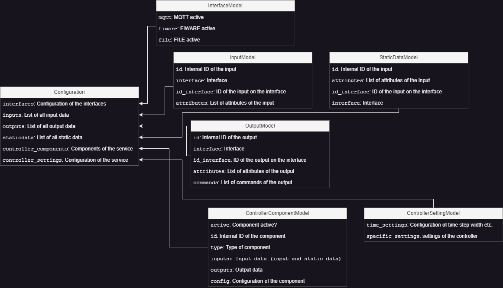

# Examples for the Configuration
The service requires a configuration via `config.json`, which needs to be created and contains all the necessary information. The configuration will be imported as a pydantic BaseModel, so the part of the config for the base service will be validated before the service starts. Additional information needed in an individual service could be added under the `controller_components` part, see [Contents of the configuration](##Content-of-the-configuration).
## Overview
- [config_doc_creation.py](./config_doc_creation.py): Configuration model export script
- [config_schema.drawio](config_schema.drawio.png): Configuration model schema
- [config.ipynb](./config.ipynb): Example of how to use the config (uses this [config.json](./config.json))
- [config.json](./config.json): Example for a configuration

## Content of the configuration
- The configuration consists of several sections.
- The following image provides a short overview, more information can be found here:
    - [schema.yml](schema.yml) as doc
    - [encodapy/config/models](./../../encodapy/config/models.py) for the code

    