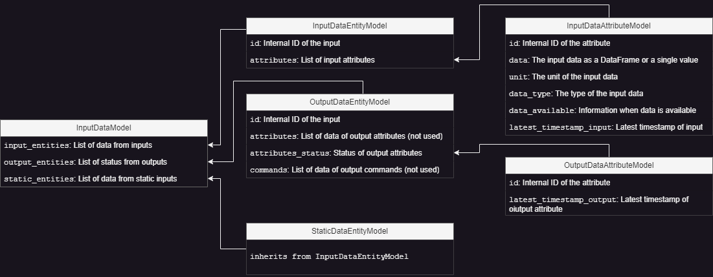
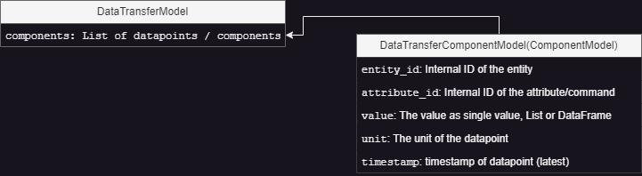

# Datatransfer
The basic service provides the communication module to the different interfaces. The input and output data to the custom functions must be structured for secure data exchange. For the definition, see [n5geh.encodapy/encodapy/utils/models.py](./../../encodapy/utils/models.py):
- `InputDataModel`: Input model for the functions
- `DataTransferModel`: Model for the output of the `calculation()` function

The `OutputDataModel` is used in the basic service interface to restructure the data for export via the interfaces.

## Examples in the folder
- [InputDataModel.ipynb](./InputDataModel.ipynb): Example of what the InputDataModel looks like with real data
- [DataTransferModel.ipynb](./DataTransferModel.ipynb): Example of how to use the DataTransferModel as result of the `calculation()`

## Model details

### Input Model `InputDataModel`

Model for the input data (configured in the config of the base service) as Pydantic BaseModel, contains information about:
- The regular input `input_entities` with the required data as a list of entities,
- The static input `static_entities` in the same structure as the regular input,
- The status of the output attributes `output_entities`, only an information about the last known value.

The following figure shows the scheme.

### Output Model `DataTransferModel`
Model for the results of the `calculation()` as Pydantic BaseModel, contains a list of datapoints (`DataTransferComponentModel`) about:
- `entity_id`: ID of the entity
- `attribute_id`: Internal ID of the attribute/command
- `value`: The value as single value, List or DataFrame
- `unit`: The unit of the datapoint
- `timestamp`: The (latest)timestamp of datapoint

The following figure shows the scheme.

